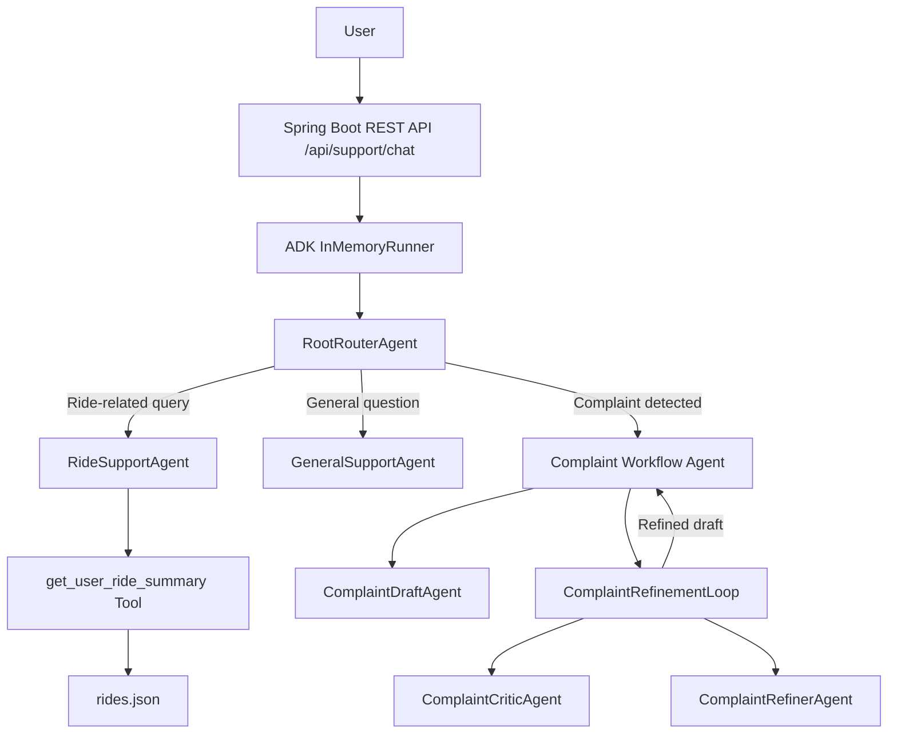
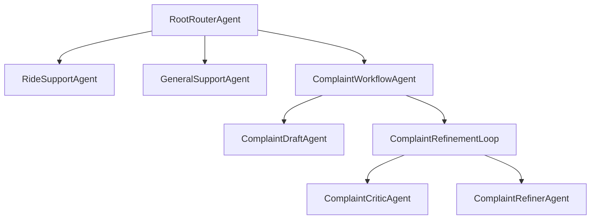
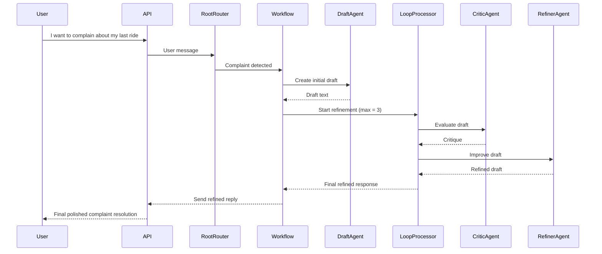

# CC-AgenticAI
## 📘 Aotoza Customer Care Agent — Agentic AI (Capstone Project)

Multi-Agent System | Google ADK Java | Spring Boot | Tools | LoopAgent | Sessions & Memory | Observability

### ⭐ Overview

This project implements an Agentic AI–powered Customer Support System for Aotoza, your mobility platform.

For the capstone project, we intentionally do NOT connect to real Aotoza services.
Instead, the agent uses a demo dataset (rides.json) to simulate user ride history.

This project demonstrates 5+ advanced Agentic AI capabilities, fulfilling Google’s capstone criteria:

Feature	Implemented
1. Multi-Agent System	✔ Root Router → Ride + General + Complaint Workflow Agents
2. Tools (custom)	✔ get_user_ride_summary (loads rides.json)
3. LoopAgent	✔ Complaint refinement loop (Critic + Refiner, iterative)
4. SequentialAgent	✔ Draft → Loop refinement
5. Sessions & Memory	✔ ToolContext.state() + SessionService
6. Observability	✔ Logging, metrics, traces, error capture
7. Context engineering	✔ Structured instructions, state-based refinement
8. Deployment	✔ Spring Boot REST API

## 🎯 Problem Statement

Aotoza requires an AI-powered customer support experience that can:
1. Answer questions about a user's last ride
2. Respond to app-related queries
3. Handle customer complaints professionally
4. Refine the complaint response through iterative reasoning 
5. Maintain conversation context 
6. Provide transparency via logs, traces, and metrics

Constraints:
* Must not access real Aotoza backend.
* Must rely only on demo/test data.
* Must satisfy Google’s Agentic AI capstone requirements.

## 🧠 Solution Summary

We built a Spring Boot application using Google ADK (Agent Development Kit) integrating:

### ⭕ Multi-Agent Architecture
* RootRouterAgent

    Routes queries to specialized sub-agents:
    * RideSupportAgent 
    * GeneralSupportAgent 
    * ComplaintWorkflowAgent (Sequential + LoopAgent)

### 🛠 Tools
* Custom FunctionTool:
    get_user_ride_summary(identifier)
→ Reads rides.json and returns structured data.

### 🔁 LoopAgent
Used in complaint workflow:
* DraftAgent – initial complaint response 
* CriticAgent – analyzes draft 
* RefinerAgent – improves based on critique 
* Loop until max iterations reached (3)

### 💾 State & Session

* Uses ADK’s InMemoryRunner + SessionService 
* Persists:
  * user:last_phone 
  * complaint_response 
  * complaint_critique

### 📊 Observability
* Structured logs for every agent event
* Tool call logging
* Error logging
* Request counter (Micrometer)
* Tool call counter
* Optional Dev UI support

## 🏛 High-Level Architecture

## 🧩 Agent Hierarchy



## 🔄 Complaint Refinement Flow (Sequence)


## 📁 Project Structure
```css
src/main/java/com.aotoza.agent
  ├── config
  │     ├── RouterAgentConfig.java
  │     ├── SubAgentsConfig.java
  │     ├── ComplaintAgentsConfig.java
  │     └── AgentRunnerConfig.java
  ├── tools
  │     └── RideTools.java
  ├── web
  │     ├── ChatRequest.java
  │     ├── ChatResponse.java
  │     └── SupportChatController.java
  ├── trace
  │     └── ConversationTraceStore.java
  └── AotozaSupportAgentApplication.java

src/main/resources/data
  └── rides.json
```
## 🛠 Setup & Installation
1. Clone the repository
    ``` bash
    git clone https://github.com/<your-repo>/CC-AgenticAI.git
    cd CC-AgenticAI
    ```
2. Install Java

    JDK 21+ required
3. Set Google API Keys (Windows)
   
    PowerShell:
    ``` powershel
    $env:GOOGLE_API_KEY="YOUR_KEY"
    $env:GOOGLE_GENAI_USE_VERTEXAI="FALSE"
    ```
4. Run the application
    ```bash
   mvn spring-boot:run
   ```
5. Test the API

    Start conversation:
    ```bash
   curl -X POST http://localhost:8080/api/support/chat \
    -H "Content-Type: application/json" \
    -d '{
      "userId": "demo-user",
      "message": "Hi, I have a question about my last ride"
   }'
   ```
   Continue conversation (use sessionId from previous output):
   ```bash
   curl -X POST http://localhost:8080/api/support/chat \
    -H "Content-Type: application/json" \
    -d '{
      "userId": "demo-user",
      "sessionId": "PASTE_ID_HERE",
      "message": "+1-415-555-1010"
    }'
   ```
## 🧪 Observability & Traceability
We implemented:
1. Structured logs
   * Tool calls
   * Sub-agent routing 
   * Function responses 
   * Errors
2. MDC (Mapped Diagnostic Context)

    Every log line includes:
    ```csharp
   [sessionId=user-1 session=aa2a3...]
   ```
3. Micrometer Metrics
   Available endpoints:
    ```bash
    /actuator/metrics/aotoza.agent.requests.total
    /actuator/metrics/aotoza.agent.tool_calls.total
   ```
4. Conversation Trace Store

    /api/support/traces endpoint for auditing internal agent output.

5. ADK Dev UI (optional)

    You can run Dev UI using AdkWebServer.start(agent).

## 📦 Demo Data

rides.json contains synthetic ride data:

* Pickup / Drop
* Fare 
* Driver info 
* Ride status 
* Last ride request status

Agents answer all ride-related queries based on this file.

## 🚀 Deployment

This is a standard Spring Boot app — deploy anywhere:

* Heroku 
* Google Cloud Run 
* AWS ECS / EC2 
* Docker

## 🔮 Future Improvements
| Feature             | Description                            |
| ------------------- | -------------------------------------- |
| RAG pipeline        | Load ride conversations dynamically    |
| Vector DB           | Improve complaint similarity detection |
| Multi-turn memory   | Persistent memory per user             |
| WebSocket streaming | Real-time typing & output              |
| Frontend UI         | Chat interface for customers           |

## 🏁 Conclusion
This project demonstrates a complete, production-style Agentic AI system:

✔ Multi-Agent architecture

✔ Tools (FunctionTool)

✔ LoopAgent for iterative reasoning

✔ Spring Boot integration

✔ Observability (logs + metrics + traces)

✔ Sessions + state continuity

✔ Demo dataset grounding

Perfect for Google’s Agentic AI capstone and extendable to real Aotoza production in the future.